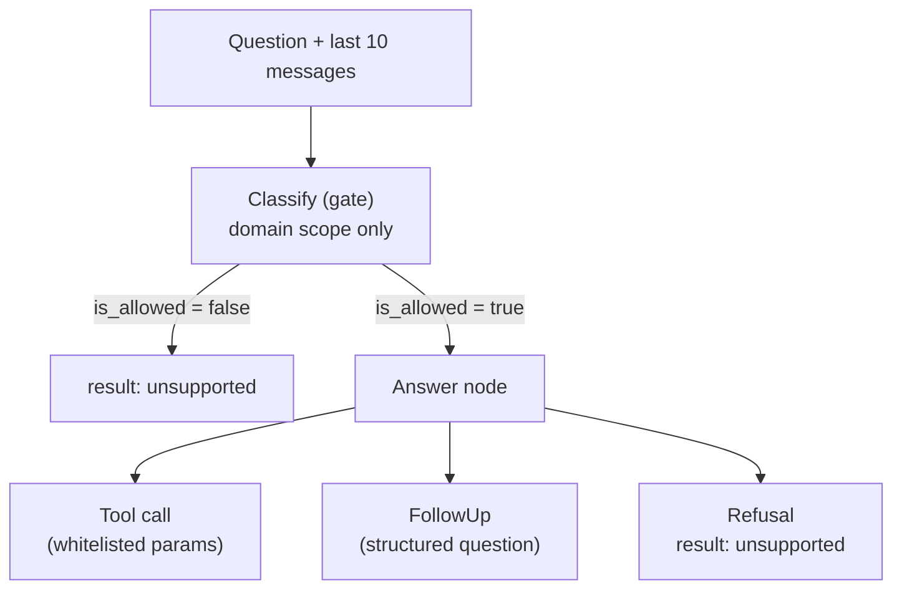

# Agent Node Design

Two LLM nodes. Each has one job. All LLM outputs are structured — free text exists only as prose wrapped around a tool result.

## Graph



## State

```python
class AgentState:
    messages: list        # loaded from checkpointer
    is_allowed: bool
    reject_reason: str    # written by Classify only; Answer never reads it
```

## Node responsibilities

| Node | Owns | Never does |
|---|---|---|
| **Classify** | Domain-scope verdict. Input: question + last 10 messages + tool descriptions. Output: structured `{is_allowed, reject_reason}` | Answer the question, compute, judge parameter validity |
| **Answer** | Interpret intent, then emit exactly one of the 4 legal outputs below | Read `reject_reason`; compute anything; produce free text before a tool result exists |

## Answer node — the only 4 legal outputs

*(Amended 08_25_2026, Slice 3: the forecast tool is the documented 4th output — see D7. The 7 rules below bind unchanged.)*

| Output | Schema | When |
|---|---|---|
| Tool call | Whitelisted params (Pydantic) | Intent is clear |
| `FollowUp` | `{missing_info, question, options[]}` — validator rejects any digit in `question` | Intent unclear (e.g. no time range given) |
| Refusal | Envelope with `display: "unsupported"`, `data: null` | In domain, but params outside whitelist — reply lists the supported attributes |
| Forecast tool call | `{sku, horizon}` (Pydantic; horizon 1..12, default 4) | Intent is a prediction — the tool computes history + projection + recommendation in `calculator/` and emits the `forecasting` stage while it runs |

```python
class FollowUp(BaseModel):
    missing_info: str          # what was unclear, e.g. "time range"
    question: str              # shown to the user; validator: no digits
    options: list[str] = []    # supported values, rendered as chips
```

## Refusals live in two layers, by design

| Layer | Rejects | Example |
|---|---|---|
| Classify | Out of domain | "weather", "write a poem" |
| Answer | In domain, unsupported params | "delayed orders by destination city" (city is not a group-by) |

Both emit the identical `unsupported` envelope, so the UI treats them the same. Identical because it is built once — both branches converge on the `enforce` node and execute the same dict literal; the Answer layer's refusal tool hands back only its reason.

## Rules for the coding agent (strict)

1. Every digit in final prose must exist in the tool result. No exceptions.
2. Free text is legal only *after* a tool result, wrapping it.
3. Relative dates ("last 3 months") leave the LLM as symbols (`last_3_months`); the tools layer resolves them to concrete dates, anchored to today. An empty result is a valid answer: HTTP 200, `rows: []`, params echoed (decision D15).
4. Both refusal paths emit the same `unsupported` envelope (decision D23).
5. `agent/` imports nothing from `calculator/` or `data/` — reaches them only through `tools/`.
6. Classify context = last 10 messages, no more.
7. A `FollowUp` is not a final answer — the turn ends, the user's reply re-enters the graph at Classify, which resolves it against the conversation context.

## Decision log

### D1 — Two-node graph: Classify gate + Answer

|  |  |
| --- | --- |
| **Chose** | Classify judges domain scope only; Answer interprets and acts. Answer never reads `reject_reason`. |
| **Why** | One job per node. The gate stays cheap and simple; interpretation stays in one place. |
| **Gave up** | Two LLM calls per question instead of one — extra latency and cost on every turn. |

### D2 — Refusals live in two layers

|  |  |
| --- | --- |
| **Chose** | Classify rejects out-of-domain; Answer rejects in-domain-but-unsupported params. Same `unsupported` envelope from both — **built in one place**: the `enforce` node, which both branches of the graph reach. The Answer side's refusal tool returns only its *reason*, never an envelope. |
| **Why** | Classify only sees tool descriptions, so it cannot judge the whitelist. Someone downstream must. Two *verdicts* is unavoidable; two *builders* is not, and two builders is how "identical" quietly becomes "similar". |
| **Gave up** | "All refusals in one place" — the refusal *verdict* has two homes. The envelope does not: `agent/nodes.py::_unsupported` is the only code that writes `display: "unsupported"`, gated statically by `tests/test_agent_rules.py`. |

### D3 — FollowUp is a structured output, not free text

|  |  |
| --- | --- |
| **Chose** | `{missing_info, question, options[]}` with a validator rejecting digits in `question`. |
| **Why** | A free-text follow-up could smuggle an invented number before any tool ran, and the no-invented-digit gate has no tool result to check against yet. Schema makes the rule code, not a prompt hope. |
| **Gave up** | Less natural phrasing; the enum of askable things grows by hand. |

### D4 — Relative dates leave the LLM as symbols, resolved in code, anchored to today

|  |  |
| --- | --- |
| **Chose** | Model emits `last_3_months`; tools layer converts to concrete dates from today's date. Empty result = valid answer (D15), params echoed. |
| **Why** | Date math is computation, and AI never computes. Anchoring to today keeps the tool honest about what the user asked. |
| **Gave up** | The spec's own example questions ("last 3 months", "last month") return empty results on this 2025-only dataset. Accepted; the echoed params must make the empty answer explain itself. |

### D5 — Classify context = last 10 messages

|  |  |
| --- | --- |
| **Chose** | Classify reads the question plus the previous 10 messages from the checkpoint. |
| **Why** | A short reply to a follow-up ("last 3 months") looks out of scope alone; with context it is clearly an answer. |
| **Gave up** | Slightly bigger prompt per turn; a reference further back than 10 messages is lost. |

### D6 — Answer is `langchain.agents.create_agent`, flow controlled by prompt *(implementation, 08_24_2026)*

|  |  |
| --- | --- |
| **Chose** | The Answer side runs on the prebuilt `create_agent` (verified in langchain 1.3.16) with the legal outputs as its only tools (`QueryParams` executes; `FollowUp`/`Refuse` are sentinels), rules 1–7 stated in the system prompt. Classify stays a separate structured call before the agent. This document stays the **behavioral contract**; enforcement moves from graph topology to a post-hoc wrapper — the `enforce` node, which **both** conditional-edge branches converge on: the follow-up sentinel's envelope wins and trailing prose is discarded; the refusal sentinel returns only a reason and `enforce` builds the one `unsupported` envelope from it, the same call the gate branch makes; else the digit-check (rule 1) runs against the query result; no tool called → `unsupported` after 1 retry. `checkpointer` and provider are `create_agent` params. **Provider amended 08_24_2026 (D24):** one provider everywhere — the Anthropic API, `claude-haiku-4-5-20251001`, built by `init_chat_model` from a single `LLM_MODEL` env value. Forced tool choice works there, so "tool call before text" is structural again rather than prompt-only. |
| **Why** | Tech-lead call: simplest thing that can pass the gates first; the S2.3/S2.4/S2.7/S2.8 gates — not the graph — are what prove the rules hold. |
| **Gave up** | "Tool call before text" and "one tool call max" stop being structural; a local model can drift and the prompt is the first defense. **Escalation, decided now:** if the gates cannot pass under prompt control, add `create_agent` middleware hooks first, the hand-built two-node graph second. |
### D7 — The forecast tool is the 4th legal output; `forecasting` joins the stage enum *(Slice 3, 08_25_2026)*

|  |  |
| --- | --- |
| **Chose** | A 4th tool, `forecast{sku, horizon}`, appended to the Answer node's list. Classify sees it through the rendered tool descriptions — no prompt edit. All maths stay in `calculator/forecast.py`; a sparse or unknown SKU makes the tool hand back the same single-key refusal-reason JSON as the refusal sentinel, so `enforce` stays the only envelope builder (rule 4 unchanged). The closed SSE stage enum is hand-extended with `forecasting`, emitted by the tool as a LangGraph custom stream event because the tool runs *inside* the answer node and no node update can announce it. |
| **Why** | Requirement 2.5 asks for forecasting through the same chat; a 4th structured output extends the existing contract without touching a rule. |
| **Gave up** | Zero-churn reuse of `querying` for the forecast stage; the enum now names four stages in four places. |
