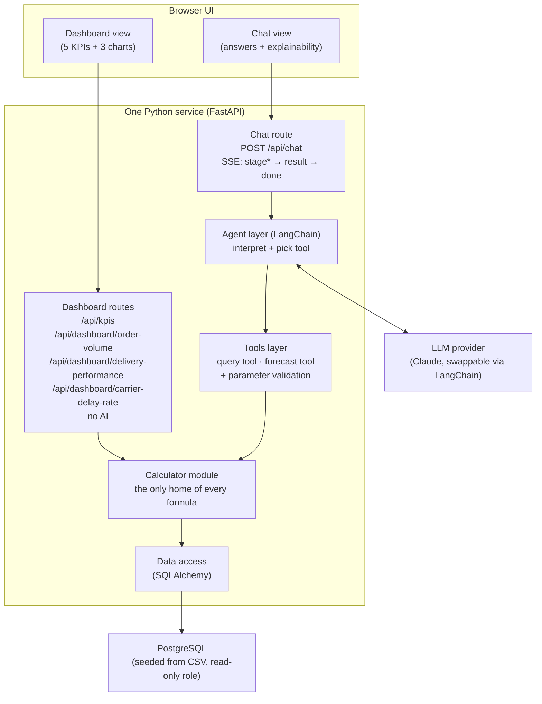
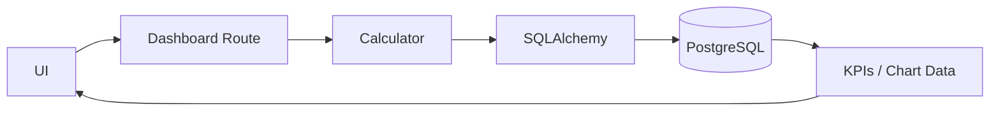
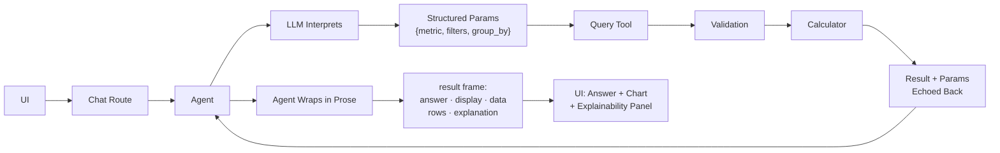
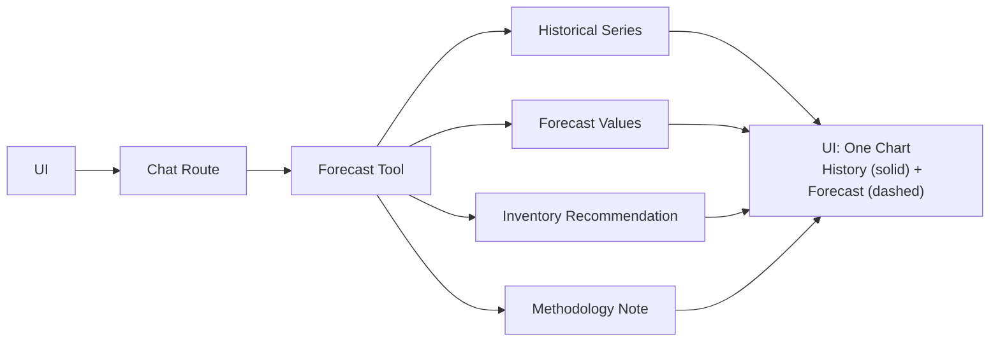

# Architecture — AI-Powered Logistics Analytics Dashboard

## 1. Context and goals

# Project Summary

A web app for logistics managers with three features — **KPI dashboard**, **natural-language Q&A**, and **demand forecasting** — built on one shared dataset (400 rows from `mock_logistics_data.csv`, read-only in PostgreSQL).

## Core Rule

The AI only **translates** questions into tool calls — it never calculates.
All numbers come from our own code.
This keeps data accurate and AI behavior trustworthy.

## Decision Record

This document is the single source of truth for decisions — see **Section 4** for all trade-offs.

---

## 2. High-level design

> **Deliberate deviation:** this box originally read `/api/kpis · /api/charts`. Slice 1 ships three parameterless routes under `/api/dashboard/` instead of one composed `/api/charts`, so the front-end composes the dashboard and owns the three display types. Reasoning and cost: `docs/decision-log.md` **D9**.

> **Deliberate deviation:** the chat route was drawn as plain request/response. It is the app's one streaming surface — `text/event-stream`, advisory `stage` frames, then one `result` frame, then `done`. Dashboard routes stay plain JSON. Reasoning and cost: `docs/decision-log.md` **D20**, **D23**.

**In words:** every number — dashboard or chat — passes through the same calculator module. The agent can only _ask_ for numbers. It can never produce them.

**Two deployables in total:** this service and the database.

---

## 3. Components and responsibilities

Everything except the browser and the database runs in one Python process. Separation is by **module**, not by service.

| Module                               | Responsibility                                                                                                         |
| ------------------------------------ | ---------------------------------------------------------------------------------------------------------------------- |
| **UI**                               | Render the dashboard (5 KPIs, 3 charts) and the chat (answer cards + explainability panel)                             |
| **Dashboard routes**                 | Serve fixed KPI/chart requests by calling the calculator                                                               |
| **Chat route**                       | Take a question, hand it to the agent, stream progress, return the answer plus its interpretation in one `result` frame     |
| **Agent layer** (LangChain)          | Interpret the question, pick a tool, produce **structured parameters**                                                 |
| **LLM provider** (Claude, swappable) | Natural-language understanding only                                                                                    |
| **Tools layer**                      | Exactly two tools (query, forecast); validate parameters against a whitelist before running them                       |
| **Calculator module**                | **The single owner of every formula and business definition** — "delayed", on-time rate, average delivery time, demand |
| **Data access** (SQLAlchemy)         | Typed models, sessions, executing the statements the calculator hands it (**D18**)                                     |
| **PostgreSQL**                       | Store the 400 rows seeded once from the CSV; read-only role                                                            |

### Separation of concerns by folder

We run one service, so that boundary does not exist for free. We recreate it with folders and one rule per folder.

| Layer                          | Folder                 | Rule                                                                        |
| ------------------------------ | ---------------------- | --------------------------------------------------------------------------- |
| AI interpretation              | `agent/`               | Never imports `calculator/` or `data/`. Reaches them only through `tools/`. |
| Business logic / orchestration | `api/`, `tools/`       | Holds no formulas. Calls the calculator.                                    |
| Data computation               | `calculator/`, `data/` | Never imports `agent/`. `calculator/` owns every formula **including the SQL expressions that express them**, and builds *unexecuted* SQLAlchemy `Select` objects. Only `data/` opens a connection and executes one. |

Each folder is one layer. The import rules are the boundary: as long as they hold, the layers stay independent and any one of them can later move into its own service.

The Slice 0 import-linter contract *"Only the data layer touches the database"* was **split in two** to state exactly that: `agent/`, `api/` and `tools/` still may not import `sqlalchemy` or `psycopg` at all, while `calculator/` may import `sqlalchemy` (to build the expression) but may not import `psycopg` or `data.engine` / `data.repository` (to run it). This is a deliberate deviation from the shipped contract, recorded as **D18** in `docs/decision-log.md`.

---

## 4. Key decisions and reasoning

### Decision 1 — One calculator module owns every formula

|               |                                                                                                                             |
| ------------- | --------------------------------------------------------------------------------------------------------------------------- |
| **Decision**  | All formulas and business definitions live in one module. Routes and tools only call it.                                    |
| **Why**       | Dashboard and chat can be asked the same question. Two copies of a formula drift apart, and the product contradicts itself. |
| **Trade-off** | The module becomes a change bottleneck. Fine at this scale.                                                                 |

### Decision 2 — One service for both the dashboard and the chat

|                      |                                                                                                                                                                                                        |
| -------------------- | ------------------------------------------------------------------------------------------------------------------------------------------------------------------------------------------------------ |
| **Decision**         | One Python (FastAPI) service serves both. The agent must be Python, so the whole stack is Python and the calculator is a plain in-process call.                                                        |
| **Why**              | Fewer parts, fewer independent failures — the app is either up or down. No serialization, no protocol layer, no second toolchain. Good for the MVP(dev fast)                                           |
| **Trade-off**        | The layers lose their process boundary. Folders and import rules replace it (section 3).                                                                                                               |
| **Rejected for now** | Separate dashboard and chat services. Worth it when workloads diverge — chat is slow and LLM-bound, the dashboard is fast and cacheable. The calculator is already the seam, so the split stays cheap. |

### Decision 3 — AI never computes

|               |                                                                                                                                                            |
| ------------- | ---------------------------------------------------------------------------------------------------------------------------------------------------------- |
| **Decision**  | The agent only outputs a tool choice, structured parameters, and prose around a tool result. Every number traces back to a tool run over the real dataset. |
| **Why**       | It is the one rule that makes the numbers trustworthy. A model that can answer from memory will eventually answer wrongly and confidently.                 |
| **Trade-off** | Only pre-defined metrics and filters work. Some reasonable questions get "I can't answer that". We prefer a refusal to a wrong number.                     |

**Two layers make this structural, not a prompt instruction:**

1. **Forced tool use** — the model must emit a tool call before it can reply. Plain text is not a legal first answer.
2. **Numbers come from the tool result field**, not from model text. The UI prints the tool's value; the agent writes the words around it.

---

## 5. Data flow

**Dashboard path (no AI involved):**

**Chat path (query):**

**On the wire.** One open stream, not three responses: `stage` frames (`interpreting` → `querying` → `composing`) drive the design's "Working on it" list, then one `result` frame carries the answer and `done` closes. Stages are advisory — a client that ignores them still renders correctly. An out-of-scope question is not an error: it returns a normal `result` with `display: "unsupported"`. See **D20**–**D23**.

**One `rows` array, three consumers** — chart, table toggle, explainability panel. Same query result at three zoom levels, which is why explainability costs almost nothing.

**Chat path (forecast):**

Same route, same envelope — `display: "forecast_line"`, history and prediction in one `rows` array.

**Explainability comes free:** the structured parameters the AI produced _are_ the explanation. Every answer card shows them back, plus access to the underlying rows.

---
